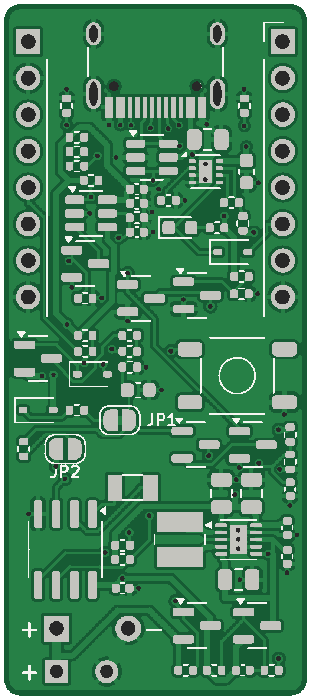
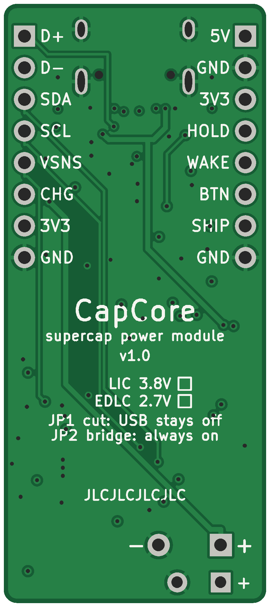

# Supercapacitor-powered gadgets

Small games, e-ink displays, blinky jewellery and music toys that charge from
USB-C in minutes and run from a **supercapacitor instead of a LiPo**. The
idea comes from the
[rechargeable supercapacitor Fibonacci earrings](https://lectronz.com/products/rechargeable-supercapacitor-fibonacci-earrings-2).

This repository has:

* **[TrinketCore](hardware/trinketcore)**: an all-in-one 40 × 60 mm trinket
  board with PCBWay order files. It has:
  * pads for two capacitors lying flat on the back;
  * USB-C charging with red "charging" and green "full" LEDs;
  * an RP2040 with 16 MB of flash;
  * a socket for OLED or colour TFT modules (the board reads its charge
    level and can show it);
  * a speaker amplifier, buttons, a wake-up clock and an expansion header.
* **[CapCore](hardware/capcore)**: an open, ready-to-order 21 × 48 mm power
  module (KiCad 7). It has a USB-C charger, capacitor protection, a power
  button, a wake-up clock and a 3.3 V output for your microcontroller.
  Gerbers and JLCPCB assembly files are included.
* **[The burst method](docs/trinket-design-method.md)**: how music boxes,
  games, pets and charms last days to weeks on a capacitor, and how colour
  TFT screens fit in.
* **[Energy budget](docs/energy-budget.md)**: how long a capacitor actually
  runs each kind of gadget, plus a [calculator](tools/energy_calc.py).
* **[Choosing a capacitor](docs/choosing-a-capacitor.md)**: lithium-ion
  capacitors vs. ordinary supercapacitors, part numbers, safety rules.
* **[Buy or build?](docs/buy-or-build.md)**: sourcing options and costs.
* **[Firmware examples](firmware)**: Arduino and MicroPython code for power
  button, sleep/wake, capacitor gauge and shutdown on CapCore, and
  CircuitPython charge-gauge, music-box and e-ink tarot-oracle examples for TrinketCore.

| TrinketCore top | TrinketCore back | CapCore top | CapCore bottom |
|---|---|---|---|
|  |  |  |  |

## The short answer

* **Capacitors are safe and fast but small.** A 3.8 V lithium-ion capacitor
  (LIC) the size of your fingertip stores ~30 mWh, about a tenth of a
  tiny 100 mAh LiPo. The largest common one (16 × 25 mm) stores ~210 mWh. In
  exchange it charges in minutes, lasts tens of thousands of cycles, and is
  far less of a fire risk. Plain 2.7 V supercapacitors (EDLCs) are essentially
  inert but hold about a tenth as much again for the same size.
* **What that runs, per charge** (with a 120 F LIC, 12.5 × 25 mm):
  LED jewellery ~1.5 days · e-ink display updated hourly ~6 weeks ·
  OLED handheld game ~50 min · MP3 player on a speaker ~15 min.
  E-ink and jewellery are great fits, games work for short sessions, music
  players are a stretch. [Details](docs/energy-budget.md).
* **The electronics matter.** LICs must never go below 2.2 V or above 3.8 V,
  and LiPo chargers (4.2 V) would destroy them. CapCore handles that: it
  charges to 3.71 V, disconnects at 2.61 V and stays off until USB returns.
  Build it for ordinary supercapacitors instead by changing two resistors.

## Quick start

1. Pick a capacitor: [choosing a capacitor](docs/choosing-a-capacitor.md).
2. **For a complete trinket:** order TrinketCore assembled from PCBWay with the
   files in [`hardware/trinketcore/fab`](hardware/trinketcore/fab). See
   [ordering](hardware/trinketcore/README.md#ordering-from-pcbway). Plug in a
   display module, fit the capacitors, and load the
   [CircuitPython examples](firmware/trinketcore).
3. **For your own microcontroller board:** order CapCore from JLCPCB with the
   files in [`hardware/capcore/fab`](hardware/capcore/fab) (see
   [ordering](hardware/capcore/README.md#ordering-from-jlcpcb)), run the
   [bring-up checks](hardware/capcore/README.md#bring-up), and wire it to your
   microcontroller ([Pico, Feather, bare chips](hardware/capcore/README.md#connecting-a-microcontroller)).

## Status

Both designs are complete and machine-checked: each schematic and PCB matches
its netlist pin for pin, and KiCad DRC is clean apart from cosmetic footprint
warnings. **Neither board has been manufactured and tested yet.** Order a
small first batch and follow the bring-up steps before building anything you
depend on.

## Repository layout

```
docs/                   guides and board renders
firmware/               Arduino + MicroPython (CapCore), CircuitPython (TrinketCore)
hardware/trinketcore/   all-in-one board: KiCad project, PCBWay files, generator scripts
hardware/capcore/       power module: KiCad project, JLCPCB files, generator scripts
tools/energy_calc.py    runtime calculator
```

No license file yet. Pick one before sharing the design: for example
CERN-OHL-P-2.0 for the hardware and MIT for the code.
