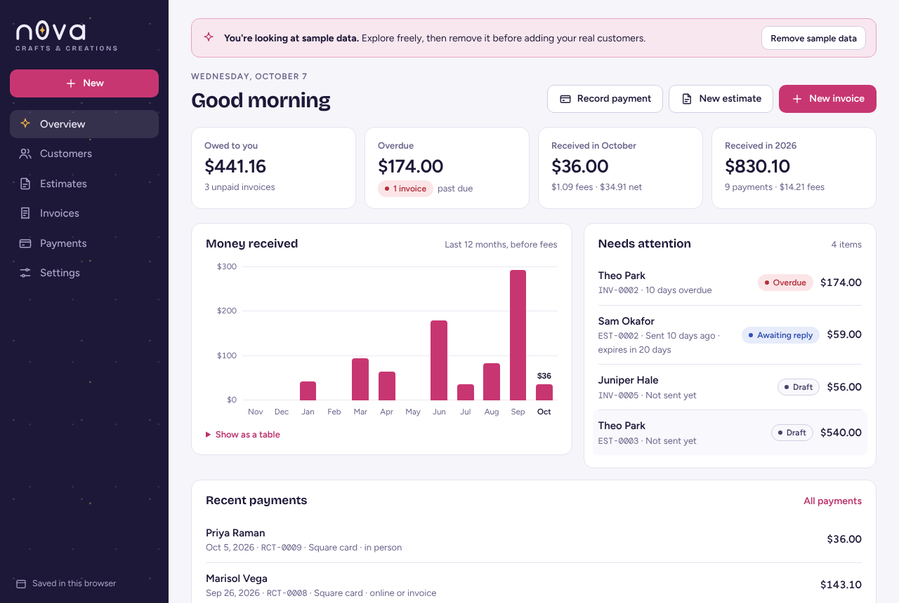
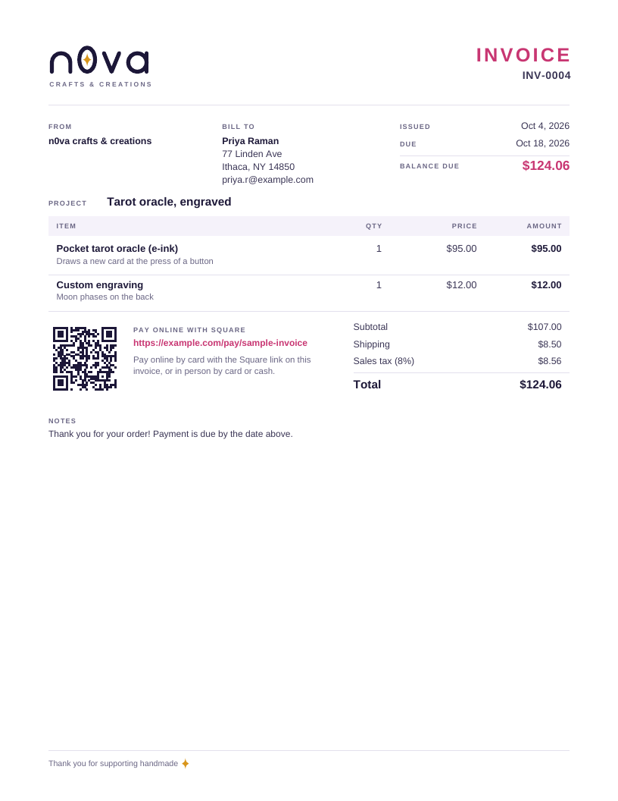

# n0va Books

Bookkeeping for **n0va crafts & creations**: customer profiles, estimates, invoices,
payments and receipts, all carrying the n0va brand. It's built for a maker who takes
payments through Square: Square moves the money, and n0va Books keeps the books,
issues the documents and tracks who owes what.



## What it does

* **Customers.** Name, business, email, phone, social handle, shipping address, tags
  (wholesale, market regular…) and private notes (ring sizes, allergies). Each profile
  shows what they owe, what they've paid and every estimate, invoice and payment.
* **Estimates.** Line items, discounts, shipping, sales tax and an optional deposit
  ("50% to start"). Mark them accepted or declined, then **turn one into an invoice** in
  one click.
* **Invoices.** Payment terms, due dates, partial payments and overdue tracking. Paste a
  **Square payment link** and it prints on the invoice as a clickable link and a QR code.
  Void an invoice instead of deleting it to keep your numbering clean.
* **Payments and receipts.** Record each payment, whether by Square card, cash, check or
  anything else, with the Square receipt or transaction ID. The app estimates Square's
  processing fee and issues a numbered receipt (RCT-0001, RCT-0002…) that you can
  download or send.
* **Branded documents.** Download any estimate, invoice or receipt as a PDF with the n0va
  wordmark (or your own logo), your brand color, a QR code for paying online and a
  "PAID" or "RECEIVED" stamp when it applies. A ready-to-send message for each one is a
  click away.
* **Overview.** What you're owed, what's overdue, money received this month and this
  year (before and after fees), a 12-month chart and a "needs attention" list (overdue
  invoices, invoices due soon, estimates waiting on a reply, drafts).
* **Your data.** One-file backups, restore, and CSV exports of customers, estimates,
  invoices and payments for your accountant.



## Two ways to use it

**Hosted on claude.ai (easiest).** Claude published a private copy to your claude.ai
account. Open it from your artifacts (in Claude Code, run `/artifacts`). Your books are
saved in that copy's private database, so they're there on your phone and your computer
whenever you're signed in. Only you, and anyone you give edit access, can see them.
PDFs and backups download through a save prompt. Printing isn't available there, so use
the PDFs.

**Your own copy (works offline).** Download this `bookkeeping` folder and open
`index.html` in Chrome, Edge, Firefox or Safari. Nothing to install. Your books are saved
in that browser on that device, and you can also print documents directly. To use it from
anywhere, host the folder on any static site host (GitHub Pages, Netlify, Cloudflare Pages).
Each browser keeps its own books, so:

> **Download a backup regularly** (Settings → Backup and data) and keep it somewhere safe,
> like a cloud drive. The overview reminds you after 30 days. Clearing your browser's site
> data deletes books saved in the browser.

The hosted copy and your own copy keep separate books. To move between them, download a
backup from one and restore it in the other.

## Working with Square

1. **Quote a custom order.** Create an estimate with a deposit. Download the PDF, or copy
   the ready-made message, and send it.
2. **Customer says yes.** Open the estimate and choose **Turn into invoice**.
3. **Get paid.** In Square, create a payment link (Square Dashboard → Online checkout →
   Payment links) for the deposit or the full amount and paste it into the invoice. The
   PDF shows it as a link and a QR code. Or take the card in person with Square as usual.
4. **Record it here.** On the invoice, choose **Record payment**. The amount fills in with
   the balance, or tap the deposit amount. Pick the Square method, paste the Square
   receipt number, and save. That issues the receipt and updates the balance.
5. **Market sales** don't need an invoice: record a payment with no invoice, and add a
   customer only if you want to.

Fees are **estimates** from the rates in Settings → Payment methods. The defaults are
Square's US Free-plan rates as of January 2026: 2.6% + 15¢ in person, 3.3% + 30¢ online
and invoices, 3.5% + 15¢ keyed in, 1% (minimum $1) bank transfer. If you're on Square
Plus or Premium, or outside the US, change them to match. Your Square Dashboard has the
exact fee for every payment, and you can type it in.

## Make it yours

Settings → **Logo and colors**: keep the n0va wordmark (the 0 is a ring holding a star),
upload your own logo (PNG, JPG or SVG), or use your business name as text. Pick a brand
color; buttons, highlights and document titles follow it, and the app keeps text readable
in light and dark mode. Settings → **Business details** fills the "From" block on every
document; **Estimates and invoices** sets currency, paper size (Letter or A4), payment
terms, tax, default notes and numbering (prefixes and the next number, which only ever
goes up so no number is used twice).

## For developers

Plain HTML, CSS and JavaScript: no framework and no build step. Scripts load as classic
scripts, so `index.html` also works opened from disk.

```
index.html            the app shell
app.css               all styles (tokens at the top; print styles at the end)
js/util.js            money in integer cents, local dates, CSV
js/calc.js            totals, invoice and estimate status, fees, monthly rollups (pure)
js/store.js           storage: claude.ai db when hosted, IndexedDB otherwise, memory as a last resort
js/brand.js           the n0va wordmark as SVG and as jsPDF vector paths, brand color tokens
js/sheet.js           estimates, invoices and receipts as on-screen paper, plus message templates
js/pdf.js             the same documents as vector PDFs (jsPDF)
js/views/*.js         overview, customers, estimates and invoices, payments, settings
js/app.js             navigation, menus, boot
vendor/               jsPDF and qrcode-generator (MIT, see vendor/README.md)
tests/calc.test.js    unit tests for the money math
scripts/build-hosted.mjs  builds the claude.ai-hosted copy
```

Run the tests with `node --test bookkeeping/tests/calc.test.js` (Node 18 or later).
Amounts are stored as integer minor units (cents) and rounded half away from zero.

The hosted database holds up to 25,000 records in all, which is years of invoices for a
small studio. If it ever fills up, download a backup and archive old records.

## Ideas for what to add next

* **Expenses** (materials, booth fees, shipping, Square fees) for a real profit-and-loss
  and tax-time categories.
* **A product catalog** with material costs and stock counts, to see your margin on each
  piece and what to restock before a market.
* **Square CSV import**: load the transactions export from your Square Dashboard and match
  each one to an invoice, so nothing slips through.
* **Sales tax by location**, for fairs that need tax collected for their city or county,
  with a quarterly report for filing.
* **Market and mileage log**: booth fee, miles driven and sales per event, to see which
  markets are worth it.
* **Custom-order stages** (deposit paid → in progress → ready → shipped) with due dates and
  design photos.
* **Refunds, store credit and gift cards.**
