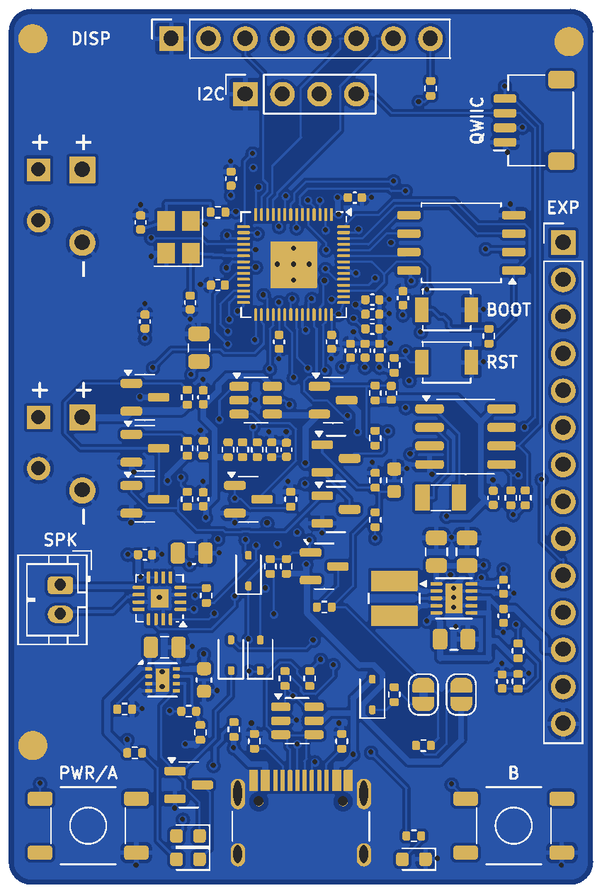
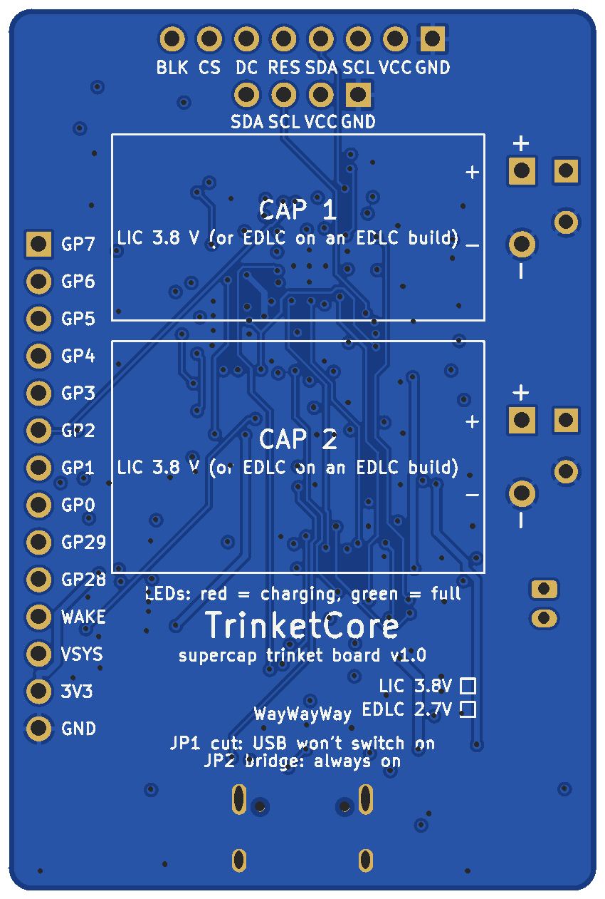

# TrinketCore: the all-in-one supercapacitor trinket board

TrinketCore puts everything a small rechargeable gadget needs on one
40 × 60 mm board, ready to order assembled from PCBWay:

* **Room for two capacitors.** They lie flat on the back, wired in parallel.
* **USB-C charging**, with a **red "charging" and a green "full" LED**.
* **A socket for an OLED or colour TFT module.** The microcontroller reads
  the capacitor's charge and can show it on the screen.
* **An RP2040 microcontroller** with 16 MB of flash for code, sounds and
  pictures.
* **A speaker amplifier**, two buttons, a user LED, a wake-up clock and an
  expansion header for LEDs, buttons and a lid switch.

The power side is [CapCore](../capcore)'s proven circuit. It cuts off before
the capacitor over-discharges, uses a soft power switch that turns the whole
board off, and has a buck-boost converter that keeps 3.3 V steady as the
capacitor drains.

| Top | Bottom (capacitor bay) |
|---|---|
|  |  |

*Renders of the actual Gerber layers. The display plugs into the socket along
the top edge. The capacitors solder into the pads on the left and lie flat
inside the outlines on the back.*

## What's on the board

| | |
|---|---|
| Capacitors | BT1 + BT2 in parallel: one or two 3.8 V lithium-ion capacitors (LIC). **EDLC build:** 2.7 V supercapacitors |
| Charging | USB-C, TI BQ25173, 300 mA: two 220 F capacitors fill in about 30 minutes. **Red LED (CHG)** while charging, **green LED (FULL)** when full (USB plugged in) |
| Protection | disconnects at **2.61 V** (LIC) / **1.96 V** (EDLC) and stays off until USB returns; ship mode for storage |
| Power switch | the whole board is **off between uses (about 5 µA)**. It turns on from button A, a lid/tilt switch on `WAKE`, the clock alarm, or USB. Firmware keeps it on with `HOLD` |
| 3.3 V | TI TPS63031 buck-boost, ~500 mA even from a nearly empty capacitor |
| Microcontroller | Raspberry Pi RP2040, 12 MHz crystal, **16 MB** Winbond flash, USB-C data for programming, BOOT and RESET buttons (SWD is not broken out: the USB bootloader is in ROM) |
| Display | **J4**: socket for SPI TFT/OLED modules (GND VCC SCL SDA RES DC CS BLK), backlight dimmable by PWM. **J5**: 4-pin I²C OLED socket. **J8**: Qwiic/STEMMA QT |
| Charge reading | capacitor voltage on an ADC pin, plus "charging" and "USB present" inputs |
| Sound | MAX98357A I²S class-D amplifier, 9 dB gain, shut down when idle; **J7** speaker connector (JST PH 2.0 or solder the wires) |
| Clock | NXP PCF8563 real-time clock: wakes the board on a timer or alarm (virtual pets, e-ink updates) |
| Buttons | **A / POWER** (turns the board on and is readable by firmware), **B**, BOOT, RESET |
| LEDs | red CHG, green FULL (charging), blue user LED on GP25 |
| Expansion | **J6**, 14 pins: GP0–GP7, GP28–GP29 (analog), `WAKE`, `VSYS`, 3V3, GND |
| Board | 4 layers, 40 × 60 × 1.6 mm, all parts on top, PCBWay standard rules (6/6 mil, 0.3 mm holes) |

## Which display?

The socket fits the common 0.96–1.54″ modules, so you can try several and pick
per product. A screen is the second-biggest power draw after a speaker, so
the firmware uses it in short bursts: wake, show, dim, switch off.

| Display | Colour | Draw (with the RP2040 running) | Good for |
|---|---|---|---|
| 0.96″ SSD1306 OLED, 128 × 64 (SPI on J4 or I²C on J5) | mono | ~35–40 mA; dark screens use less | games, menus, pets |
| 1.3–1.54″ ST7789 IPS TFT, 240 × 240 | **full colour** | ~45 mA at 60 % backlight, ~30 mA dimmed | colour animations, charms, games |
| 1.28″ GC9A01 round TFT, 240 × 240 | **full colour** | about the same as the ST7789 | keychain "digital charms" |
| 1.54″ 200 × 200 or 3.7″ 480 × 280 e-paper module (SSD1681 and similar) | black/white, 4 greys, or black/white/red | nothing between refreshes; ~30 mA for 2–3 s per black/white refresh (~14 s for three-colour) | tarot oracles, badges, pets, clocks: always visible |

**Yes, colour TFTs work well.** The backlight is most of the extra power, so
dim it and switch off after a few seconds. On two 220 F capacitors a colour
charm shown for 10 s, 30 times a day, lasts about four weeks. Played
continuously, a colour game lasts about two hours. See
[the design method](../../docs/trinket-design-method.md) for the numbers.

Module pin orders vary. Modules labelled `GND VCC SCL SDA RES DC CS BLK` plug
straight into J4. Seven-pin OLEDs (`GND VCC D0 D1 RES DC CS`) use the first
seven positions. Others, including many GC9A01 modules (`VCC GND ...`), need
short jumper wires. **Check that GND and VCC line up before plugging in.**

**E-ink works too**, and suits anything that should stay visible: the image
costs no power at all once drawn, so the board can switch fully off. E-paper
modules have a BUSY output where TFTs have a backlight input. Wire them to J4
by function (VCC → 3V3, GND, DIN → MOSI, CLK → SCK, CS, DC, RST → RES) with
BUSY on the BLK pin, which the RP2040 reads on GP13. The
[oracle example](../../firmware/trinketcore/circuitpython/oracle/code.py) shows a
random tarot card this way.

## Runtime per charge

LIC build, 85 % converter efficiency, 5 µA standby
([`tools/energy_calc.py`](../../tools/energy_calc.py)):

| Trinket | 1 × 120 F | 1 × 220 F | 2 × 220 F |
|---|---|---|---|
| Music box: 20 s tune + LEDs (~70 mA), 10 plays a day | 75 plays (8 days) | 138 plays (14 days) | 276 plays (4 weeks) |
| Colour TFT charm: 10 s shows (45 mA), 30 a day | 8 days | 14 days | 4 weeks |
| Virtual pet on e-paper: wakes every 30 min (30 mA × 3 s) | 3 weeks | 6 weeks | 3 months* |
| Tarot oracle on e-paper: a card per press (30 mA × 5 s), 10 a day | 600 draws (2 months) | 1,100 draws* | 2,200 draws* |
| OLED game, continuous (40 mA) | 45 min | 80 min | 2.7 h |
| Colour TFT game, continuous (55 mA) | 33 min | 60 min | 2 h |

\* Beyond a month or two the capacitors' own self-discharge dominates.

## Fitting the capacitors

The two capacitor positions sit along the left edge. **Square pad = +.** Each
position takes a 5.0 mm lead pitch (10–12.5 mm cans) or 3.5 mm (8 mm cans).
Bend 16 mm cans' 7.5 mm leads in slightly. Bend the leads 90° so each can lies
flat on the back inside its outline (`CAP 1`, `CAP 2`), with its leads at the
left edge. Stick a strip of Kapton tape under each can, and glue or strap
large cans.

* One capacitor is fine: fit either position.
* Two capacitors must be **the same type** (both LIC, or both EDLC on an EDLC
  build). Sizes may differ.
* Good choices: Eaton HS1225-3R8127-R (120 F, 12.5 × 25 mm) or HS1625-3R8227-R
  (220 F, 16 × 25 mm). See [choosing a capacitor](../../docs/choosing-a-capacitor.md).

> **Never fit a 2.7 V supercapacitor to a board built with the LIC values.**
> It would be charged to 3.71 V and can vent. Tick the build box on the back,
> and measure the charge voltage before fitting capacitors (see
> [Bring-up](#bring-up)).

## Pinout

**J4 display socket** (top edge, pin 1 = square pad, left):
GND · 3V3 · SCK (GP10) · MOSI (GP11) · RES (GP12) · DC (GP9) · CS (GP8) · BLK (GP13 via 100 Ω)

**J5 I²C OLED socket**: GND · 3V3 · SCL (GP17) · SDA (GP16).
**J8 Qwiic**: GND · 3V3 · SDA · SCL. The same bus as the clock (address 0x51),
with 4.7 kΩ pull-ups.

**J6 expansion** (right edge, pin 1 at the top): GP7 · GP6 · GP5 · GP4 · GP3 ·
GP2 · GP1 · GP0 · GP29 · GP28 · WAKE · VSYS · 3V3 · GND. The order matches the
RP2040's pins, which keeps the tracks from crossing; the back silkscreen labels
every pin.

* `WAKE`: pull to GND to switch the board on (lid, tilt, reed or vibration
  switch). For a **lid** that may stay open, put a 1 µF capacitor in series
  with the switch and a 22 MΩ resistor across that capacitor. Opening the
  lid then sends one wake pulse, and the board can still switch itself off.
* `VSYS`: the capacitor voltage (2.6–3.7 V), on only while the board runs.
  Use it for vibration motors or LED strips that tolerate it.
* GPIO pins drive LEDs directly, up to ~8 mA each through a resistor.

**J7 speaker**: 8 Ω, 0.5–1 W. **GPIO map**: see the
[firmware README](../../firmware/trinketcore/README.md#pin-map).

## LEDs and power states

| LED | Meaning |
|---|---|
| red **CHG** | charging |
| green **FULL** | USB plugged in and the capacitors are full |
| red and green blinking alternately | charger fault (for example a capacitor wired backwards, or overheating) |
| blue | yours (GP25) |

With USB plugged in the board also switches on, so a gauge can show charging
progress. Cut jumper **JP1** on the back if plugging in should only charge.
Bridge **JP2** for gadgets without a power button (always on above the
cut-off).

| State | Drain from the capacitors | Leaves the state when… |
|---|---|---|
| Running | your load ÷ ~85 % | firmware drops `HOLD` |
| Off | ~5 µA (clock running) | button A, `WAKE`, clock alarm/timer, USB |
| Cut-off / ship mode | leakage only | USB is plugged in |

## Ordering from PCBWay

Everything is in [`fab/`](fab):

| File | Upload / use |
|---|---|
| `trinketcore-gerbers.zip` | the PCB (Gerbers + drill) |
| `pcbway-bom-lic.csv` (or `-edlc.csv`) | assembly BOM for your build |
| `pcbway-centroid.csv` | pick-and-place positions (mm, origin at the bottom-left corner, same as the Gerbers) |
| `trinketcore-assembly-top.pdf`, `-back.pdf` | assembly drawings, if PCBWay asks |
| `parts-list.csv` | every part, including the ones you fit yourself |

1. On pcbway.com choose **PCB Instant Quote → Quick-order PCB** and upload
   `trinketcore-gerbers.zip`. It should read **40 × 60 mm** and **4 layers**.
2. Board settings:
   * Material FR-4, thickness **1.6 mm**, any solder mask colour.
   * Min track/spacing **6/6 mil**, min hole size **0.3 mm**.
   * Surface finish: **ENIG is recommended** because the RP2040 has 0.4 mm-pitch
     pads. HASL lead-free usually works too.
   * Order number: the back has a `WayWayWay` placeholder where PCBWay can
     print it. Tell them in the notes, or pick the remove-order-number option.
3. Tick **Assembly service**: turnkey, **top side only**, about
   **102 SMD parts (44 unique lines)**, no through-hole parts. Upload
   `pcbway-bom-lic.csv` and `pcbway-centroid.csv`.
4. Paste this note:
   *"BT1, BT2, J4–J7, JP1–JP2: do not populate (customer fits
   capacitors and connectors). J8 and all other parts: assemble as per BOM.
   Please confirm pin 1 of U2, U3, U4, U5, U6, U7, U8 and the LED polarity
   against the silkscreen before assembly."*
5. PCBWay's engineers review the files, source the parts, and email if a part
   needs a substitute. Resistors and capacitors may be any brand with the same
   value, size and tolerance. Approve their placement confirmation photos.

**Rough cost** (prices change, so trust the quote): about US$25–50 for five
4-layer boards, plus assembly (setup ~US$30–50, parts ~US$8–12 per board
with the RP2040, flash and amplifier). Five assembled boards typically land
around US$100–180 before shipping. Most of that is fixed, so ten cost little
more.

The same files work at other assembly houses (the BOM has manufacturer part
numbers, and LCSC numbers where known).

## Bring-up

Before fitting the capacitors:

1. Plug in USB-C. The red and green LEDs may flicker (nothing to charge yet),
   and the board switches on.
2. Measure between the square BT1 pad and GND: about **3.7 V** is the LIC build,
   **2.6 V** the EDLC build.
3. The computer should show an `RPI-RP2` drive (blank flash starts the
   bootloader). Install CircuitPython and try the
   [charge gauge](../../firmware/trinketcore) with a display on J4.

Then unplug USB, fit the capacitors (**square pad = +**), and plug USB back
in: red while charging, green when full. Unplug and press A: the board runs
for about 5 s, or longer if firmware raises `HOLD`. A new capacitor that
arrives below the cut-off keeps the board off until it has charged past it.

## Design files

| File | |
|---|---|
| `trinketcore.kicad_pro/.kicad_sch/.kicad_pcb` | KiCad 7 project |
| `trinketcore-schematic.pdf` | schematic |
| `TrinketCore.kicad_sym`, `TrinketCore.pretty/` | project symbols and footprints |
| `trinketcore.ses` | autorouter result that `route_pcb.py` rebuilds the board from |
| `scripts/` | the generators |

As with CapCore, the board is generated from code:

```
cd hardware/trinketcore/scripts
python3 gen_footprints.py
python3 gen_schematic.py && python3 check_netlist.py
python3 check_place.py
FREEROUTING_JAR=/path/to/freerouting-1.9.0.jar python3 route_pcb.py --autoroute
python3 check_netlist.py --pcb && python3 export_fab.py && python3 render.py
```

`netlist.py` is the single source of truth: parts, values, manufacturer part
numbers and every connection. Autorouting needs Java and
[Freerouting](https://github.com/freerouting/freerouting) 1.9.0 (under
`xvfb-run` on a headless machine); without `--autoroute` the board is rebuilt
from the committed `trinketcore.ses`. The crystal and the power fan-outs are
drawn by hand in `preroute.py`, and a small grid router (`maze.py`) finishes
whatever Freerouting leaves open.

**Verification status:** the schematic and PCB are checked pin-for-pin against
`netlist.py` (378 pins). KiCad DRC with PCBWay's limits reports no errors and
no unconnected items, only one warning: the USB-C footprint differs from the
library copy because its silkscreen was trimmed at the board edge. The routing
is automatic, so some tracks take detours a hand layout wouldn't. The board
has **not been built and tested yet**: treat the first order as a prototype run
and follow the bring-up steps.
